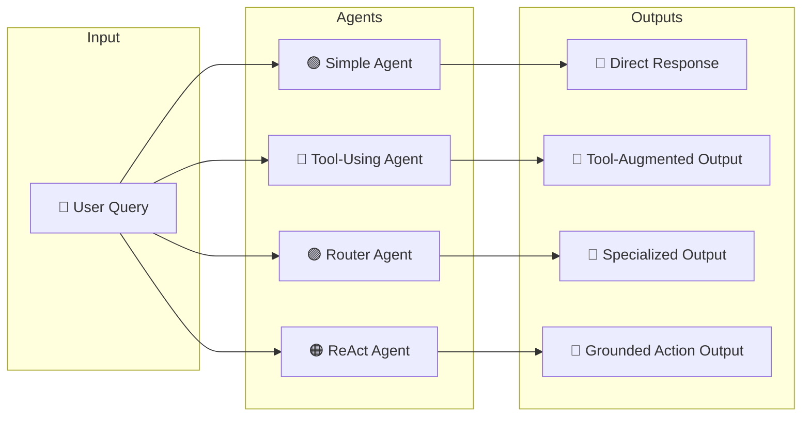
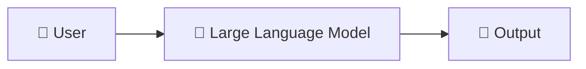
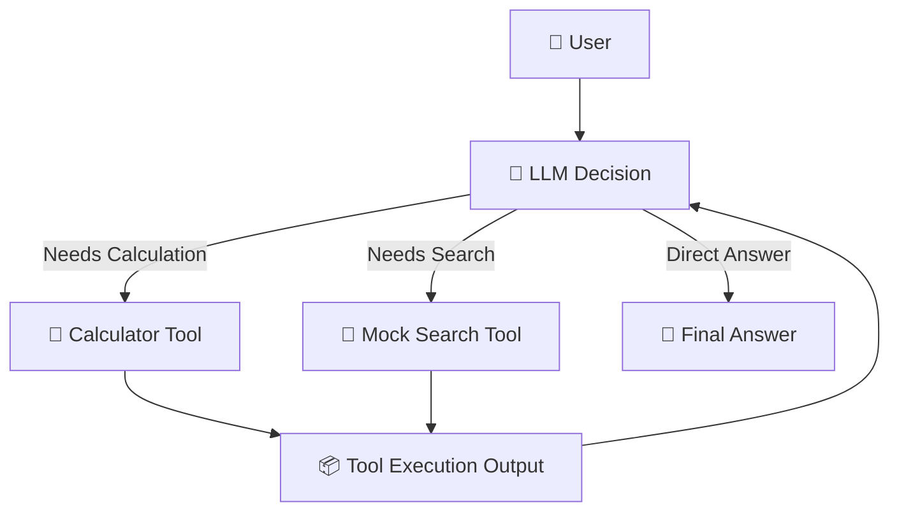
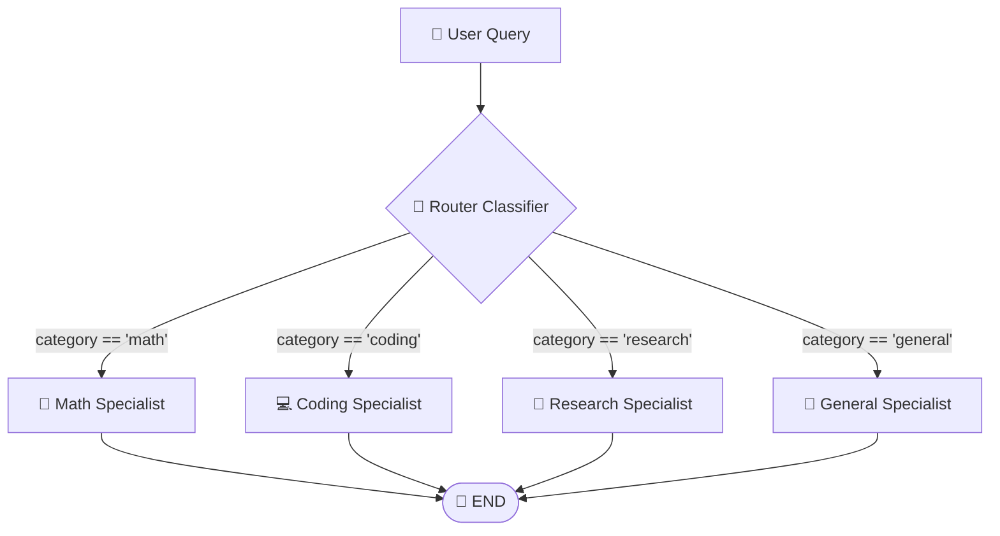
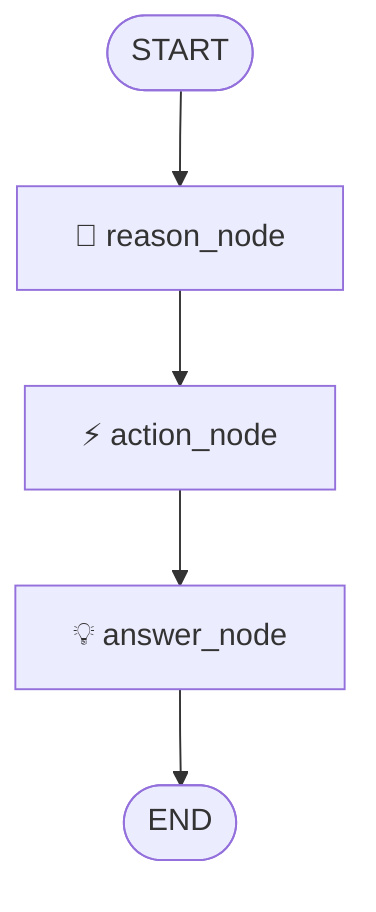

# 🤖 Build & Compare Different Agent Types

> A practical, hands-on LangChain and LangGraph project implementing, visualizing, and benchmarking four distinct agent architectures.

[](https://www.python.org/)
[](https://python.langchain.com/)
[](https://langchain-ai.github.io/langgraph/)
[](https://smith.langchain.com/)

---

## 📌 Table of Contents

<details>
<summary><b>Click to expand</b></summary>

- [📖 Project Overview](#-project-overview)
- [🧭 Architecture at a Glance](#-architecture-at-a-glance)
- [1️⃣ Simple Agent](#1️⃣-simple-agent)
- [2️⃣ Tool-Using Agent](#2️⃣-tool-using-agent)
- [3️⃣ Router Agent](#3️⃣-router-agent)
- [4️⃣ ReAct Agent](#4️⃣-react-agent)
- [🔬 Architecture Comparison](#-architecture-comparison)
- [🏗️ Project Structure](#️-project-structure)
- [⚙️ Setup & Installation](#️-setup--installation)
- [🔐 Environment Variables](#-environment-variables)
- [▶️ Running the Agents](#️-running-the-agents)
- [🔎 LangSmith Observability](#-langsmith-observability)
- [🧩 Core LangGraph Concepts](#-core-langgraph-concepts)
- [🧠 Mental Model for Building Agents](#-mental-model-for-building-agents)
- [🧪 Testing Checklist](#-testing-checklist)
- [🚀 Future Improvements](#-future-improvements)
- [👨‍💻 Author](#-author)

</details>

---

## 📖 Project Overview

When developing agentic AI systems, a single architectural pattern does not fit every use case. This project implements and compares **four fundamental agent patterns** to evaluate their decision-making capabilities, execution control, and runtime observability:

| Agent Pattern | Core Paradigm | Execution Mechanism | Primary Use Case |
| :--- | :--- | :--- | :--- |
| 🟢 **Simple Agent** | Direct Generation | `User → LLM → Answer` | Open-ended queries, explanations, creative writing |
| 🔵 **Tool-Using Agent** | Augmented Execution | `User → LLM → Tool Call → LLM → Answer` | Deterministic computation, external lookups |
| 🟣 **Router Agent** | Dynamic Classification | `User → Router → Domain Specialist → Answer` | Multi-domain assistance, system specialization |
| 🟠 **ReAct Agent** | Reason + Act | `User → Reason → Action → Observation → Answer` | Multi-step problem solving, iterative verification |

<details>
<summary><b>🎯 Assignment & Project Objectives</b></summary>

- ✅ Build a **Simple Agent** executing direct inference.
- ✅ Build a **Tool-Using Agent** with multiple integrated tools (`calculator`, `mock_search`).
- ✅ Build a **Router Agent** with specialized routes: `math`, `coding`, `research`, and `general`.
- ✅ Build a **ReAct Agent** with structured `Reason → Action → Observation` transitions.
- ✅ Implement declarative workflow control and state graphs using **LangGraph**.
- ✅ Generate visual graphs (`router_agent.png`, `react_graph.png`).
- ✅ Trace runtime steps and inspect intermediate state using **LangSmith**.

</details>

---

## 🧭 Architecture at a Glance



---

## 1️⃣ Simple Agent

### 💡 Core Concept
The Simple Agent forwards the prompt straight to the LLM without external tooling, state graphs, or intermediary classification layers.



**Implementation:** `simple_agent.py`

<details>
<summary><b>🔍 Architectural Trade-offs</b></summary>

- **Strengths:** Lowest latency, minimal token consumption, zero workflow complexity.
- **Weaknesses:** Cannot access external or real-time data; susceptible to arithmetic errors and hallucinations.

</details>

---

## 2️⃣ Tool-Using Agent

The Tool-Using Agent equips the LLM with a capability registry. When prompted, the model determines whether to answer directly or emit structured tool-call arguments.

- 🧮 **`calculator`**: Deterministic arithmetic evaluation.
- 🔎 **`mock_search`**: Retrieval interface for external queries.



### Trace Sample

```text
Input: 25 * 48
🔧 Tool called: calculator | Input: 25 * 48
Tool result: 1200
Final Answer: 25 multiplied by 48 is 1,200.
```

**Implementation:** `tool_agent.py`

<details>
<summary><b>🧠 Why Observable Tool Logging Matters</b></summary>

A correct numeric answer does not verify tool invocation; modern LLMs may correctly memorize or guess calculations. Logging concrete invocations confirms the runtime followed an augmented execution path:
`LLM → Function Call → Execution Environment → Ingestion → Synthesis`

</details>

---

## 3️⃣ Router Agent

The Router Agent classifies incoming queries into discrete functional categories using **Pydantic structured outputs**, then dispatches the query across specialized downstream sub-graphs.

### Categories
- 🧮 **`math`**: Precision arithmetic and numerical calculations.
- 💻 **`coding`**: Code generation, debugging, and software architecture.
- 🔎 **`research`**: Topic exploration and factual synthesis.
- 💬 **`general`**: Conversational inquiries and open-ended dialogue.



### Structured Routing Schema

```python
from pydantic import BaseModel, Field
from typing import Literal

class RouterDecision(BaseModel):
    """Enforce strict categorization on incoming user intent."""
    category: Literal["math", "coding", "research", "general"] = Field(
        description="The target domain best suited to resolve the user prompt."
    )
```

**Implementation:** `router_agent.py`  
**Generated Workflow Graph:** `router_agent.png`

---

## 4️⃣ ReAct Agent

### 🧠 What is ReAct?
ReAct (**Reason + Act**) in this implementation uses a linear `reason → action → answer` workflow, where the agent reasons about its objective, executes an external tool in the action step, stores the tool result as `observation` in state, and synthesizes the grounded response.

```text
┌──────────────┐     ┌──────────────────────────────────────────────┐     ┌──────────────┐
│  🧠 Reason   │ ──► │  ⚡ Action (stores Observation in State)     │ ──► │  💡 Answer   │
└──────────────┘     └──────────────────────────────────────────────┘     └──────────────┘
```

### LangGraph Workflow Topology



### Execution Example

```text
Prompt: Compute 7 - 2

[🧠 REASON]
Decision: Arithmetic operation required.
Target Tool: calculator
Tool Input: "7 - 2"

[⚡ ACTION]
Dispatching: calculator("7-2")

[👀 OBSERVATION]
Captured Result: 5

[💡 FINAL ANSWER]
7 minus 2 equals 5.
```

**Implementation:** `react_agent.py`  
**Generated Workflow Graph:** `react_graph.png`

---

## 🔬 Architecture Comparison

<details open>
<summary><b>Click to expand full matrix</b></summary>

| Dimension | 🟢 Simple Agent | 🔵 Tool-Using Agent | 🟣 Router Agent | 🟠 ReAct Agent |
| :--- | :---: | :---: | :---: | :---: |
| **Direct LLM Responses** | ✅ | ✅ | ✅ | ✅ |
| **External Tool Calling** | ❌ | ✅ | ❌ | ✅ |
| **Domain-Specific Nodes** | ❌ | ❌ | ✅ | ❌ |
| **Explicit Reasoning Step** | ❌ | ❌ | ❌ *(Categorization)* | ✅ |
| **Conditional Branching** | ❌ | ✅ *(Dynamic Tool)* | ✅ *(State Routing)* | ❌ *(Fixed linear graph)* |
| **LangGraph Implementation** | ❌ | ❌ | ✅ | ✅ |
| **Deterministic State** | ❌ | ❌ | ✅ | ✅ |

</details>

---

## 🏗️ Project Structure

```text
type-of-agent/
│
├── simple_agent.py          # Baseline LLM inference pipeline
├── tool_agent.py            # Function/tool calling runtime
├── router_agent.py          # Structured classification & conditional edges
├── react_agent.py           # Reason -> Action -> Observation state workflow
│
├── llm_config.py            # Centralized client initialization & model parameters
├── requirements.txt         # Pinned project dependencies
├── README.md                # Architectural documentation
│
├── router_agent.png         # Exported LangGraph router graph topology
├── react_graph.png          # Exported LangGraph ReAct state topology
│
├── .gitignore               # Environment & bytecode exclusions
├── .env.example             # Safe template for environment variables
└── .env                     # Local credentials (excluded from source control)
```

---

## ⚙️ Setup & Installation

### 1. Clone the Repository
```bash
git clone <your-repository-url>
cd type-of-agent
```

### 2. Configure Python Virtual Environment
```bash
# macOS/Linux
python3 -m venv venv
source venv/bin/activate

# Windows (Command Prompt / PowerShell)
python -m venv venv
.\venv\Scripts\activate
```

### 3. Install Required Packages
```bash
pip install --upgrade pip
pip install -r requirements.txt
```

---

## 🔐 Environment Variables

Create your local `.env` file using `.env.example` as a template:

```bash
cp .env.example .env
```

Set the required API credentials:

```ini
# Primary Model API Configuration
EURON_API_KEY=your_api_key_here

# LangSmith Observability & Tracing
LANGSMITH_TRACING=true
LANGSMITH_PROJECT=type-of-agent
LANGSMITH_API_KEY=your_langsmith_api_key
```

> ⚠️ **Security Warning:** Never commit `.env` files or expose API credentials in public repositories.

---

## ▶️ Running the Agents

### 1. Simple Agent
```bash
python simple_agent.py
```
*Test query:* `Explain the difference between synchronous and asynchronous execution.`

### 2. Tool-Using Agent
```bash
python tool_agent.py
```
*Test queries:*
- `Calculate 25 * 48` *(Triggers calculator tool)*
- `Explain how gradient descent works` *(Triggers direct LLM response)*

### 3. Router Agent
```bash
python router_agent.py
```
*Test queries:*
- `What is 25 * 48?` → Routes to **Math Specialist**
- `Write a Python decorator that measures execution time.` → Routes to **Coding Specialist**
- `Summarize recent developments in quantum annealing.` → Routes to **Research Specialist**
- `Tell me an interesting historical fact.` → Routes to **General Specialist**

### 4. ReAct Agent
```bash
python react_agent.py
```
*Test query:* `What is 7 - 2?`  
*Inspect stdout to verify the sequence: `Reason -> Action -> Observation -> Final Answer`.*

---

## 🔎 LangSmith Observability

Full execution traces are recorded in **LangSmith** for profiling token latency, inspect payload schemas, and verify routing decisions:

```text
User Query
    │
    ▼
[Node: router] ──────────► Outputs: category='coding'
    │
    ▼
[Node: coding_agent] ────► Executes specialized system prompt
    │
    ▼
[Output Generation]
```

To view traces, visit [smith.langchain.com](https://smith.langchain.com/) and navigate to your `type-of-agent` project dashboard.

---

## 🧩 Core LangGraph Concepts

<details>
<summary><b>1. Shared Agent State (`TypedDict`)</b></summary>

State acts as the centralized memory that flows through every node in the graph:

```python
from typing import TypedDict

class AgentState(TypedDict):
    query: str
    reasoning: str
    action: str
    observation: str
    answer: str
```

</details>

<details>
<summary><b>2. Nodes (Units of Execution)</b></summary>

Nodes are standard Python functions that receive current state and return incremental state mutations:

```python
def reason_node(state: AgentState) -> dict:
    # Formulate hypothesis and select tool
    return {"reasoning": "Determined calculator tool is required."}

graph.add_node("reason", reason_node)
graph.add_node("action", action_node)
graph.add_node("answer", answer_node)
```

</details>

<details>
<summary><b>3. Edges & Conditional Routing</b></summary>

Edges dictate transition paths between nodes:

```python
# Fixed Edge
graph.add_edge("action", "answer")

# Conditional Dynamic Edge
def route_decision(state: AgentState) -> str:
    return state["category"]

graph.add_conditional_edges("router", route_decision, {
    "math": "math_node",
    "coding": "coding_node",
    "research": "research_node",
    "general": "general_node"
})
```

</details>

---

## 🧠 Mental Model for Building Agents

When architecting agentic graphs from scratch:

```text
1. INPUT          ──► Define expected query format & incoming parameters
       │
2. STATE          ──► Determine what fields need to persist across nodes
       │
3. NODES          ──► Build modular functions for discrete units of logic
       │
4. EDGES          ──► Connect nodes via static transitions or conditional branches
       │
5. OBSERVABILITY  ──► Trace intermediate steps via LangSmith and structured logging
       │
6. OUTPUT         ──► Format final answer with citations or tool results
```

---

## 🧪 Testing Checklist

- [x] **Simple Agent:** Clean direct response generation.
- [x] **Tool Agent:** Reliable invocation of `calculator` and `mock_search`.
- [x] **Router Agent:** Validated routing across `math`, `coding`, `research`, and `general`.
- [x] **ReAct Agent:** Verified step-by-step state propagation (`Reason → Action → Observation`).
- [x] **Visualization:** Exported PNG graph topologies for Router and ReAct architectures.
- [x] **Security:** Verified `.env` and `venv/` are strictly ignored by Git.

---

## 🚀 Future Improvements

- [ ] Connect a live search provider (e.g., Tavily, DuckDuckGo) in place of `mock_search`.
- [ ] Upgrade the ReAct pattern to an iterative cyclic loop for multi-hop problem solving.
- [ ] Add conversation memory checkpoints using `MemorySaver`.
- [ ] Add real-time streaming output (`astream`) for interactive CLI interfaces.
- [ ] Implement automated regression evaluation using LangSmith datasets.

---

## 👨‍💻 Author

**Vijay Rangvani**  
*Backend & AI Engineering Learner*

---

> *Built with LangChain, LangGraph, and Python.*